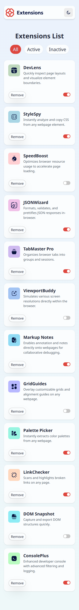
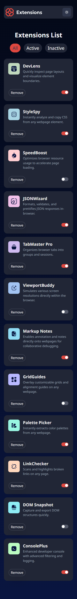
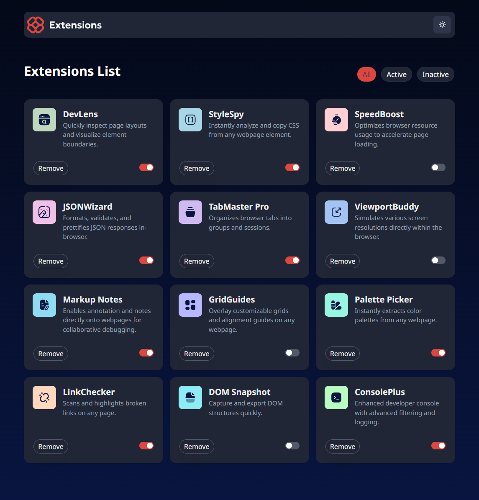

# Frontend Mentor - Browser Extensions Manager UI

This is a solution to the [Browser Extensions Manager challenge](https://www.frontendmentor.io). Frontend Mentor challenges help you improve your coding skills by building realistic projects.

---

## Table of contents

- [Overview](#overview)
  - [Screenshots](#screenshots)
  - [Links](#links)
- [My Process](#my-process)
  - [Built With](#built-with)
  - [What I Learned](#what-i-learned)
- [Author](#author)
- [Acknowledgments](#acknowledgments)

---

## Overview

A responsive UI project for managing browser extensions. Users can enable, disable, and delete extensions, with an option to undo deletions within a few seconds using a toast notification.

### Links

- 🔧 Solution URL: [GitHub Repository](https://github.com/torekulislam/browser-extensions-manager-ui)
- 🌐 Live Site: [Live Preview](https://browser-extensions-manager-ui-mocha.vercel.app/)

---

### Screenshots






---

## My Process

### Built With

- Semantic HTML5 markup
- Tailwind CSS
- React JS
- Redux Toolkit (for state management)
- Framer Motion (for animation)
- Vite (build tool)
- Mobile-first responsive workflow
- Flexbox & Grid layout

---

### What I Learned

- **Responsive Design:** Practiced building clean, mobile-first layouts that adapt to all screen sizes.
- **State Management:** Implemented efficient global state handling using Redux Toolkit.
- **React Components:** Built modular, reusable components for better scalability.
- **Toast Notifications:** Used `setTimeout` and Redux to create a timed undo feature with a user-friendly interface.
- **Dark Mode:** Learned how to apply theme-aware styling using Tailwind’s dark mode support.

- **Redux Toolkit:** Used `createSlice` and state handling

---

## Author

- GitHub – [@torekulislam](https://github.com/torekulislam)
- Frontend Mentor – [@torekulislam](https://www.frontendmentor.io/profile/torekulislam)

---

## Acknowledgments

Thanks to [Frontend Mentor](https://www.frontendmentor.io) for providing the challenge design. Also, appreciation to the open-source community for the libraries and tools used in this project.

---

## Getting Started

To run this project locally:

```bash
git clone https://github.com/your-username/browser-extensions-manager-ui.git
cd browser-extensions-manager-ui
npm install
npm run dev
```
